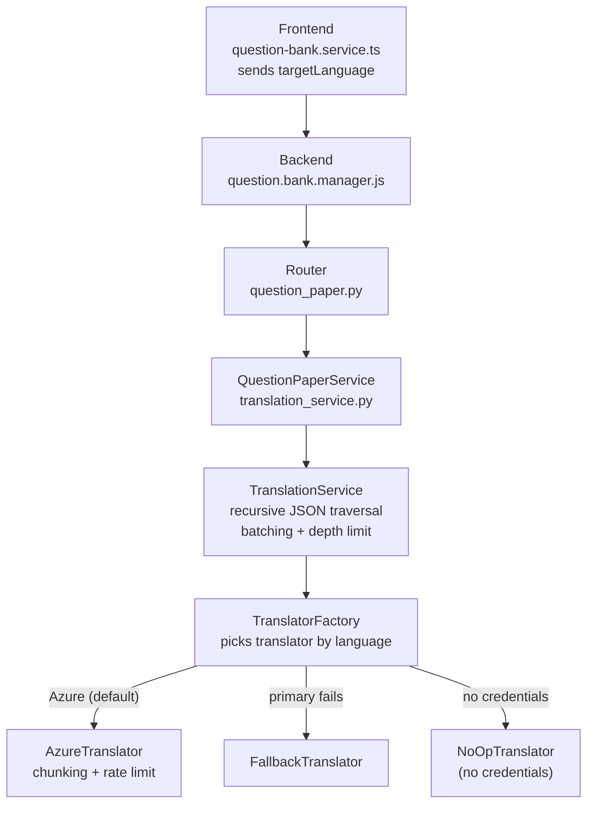
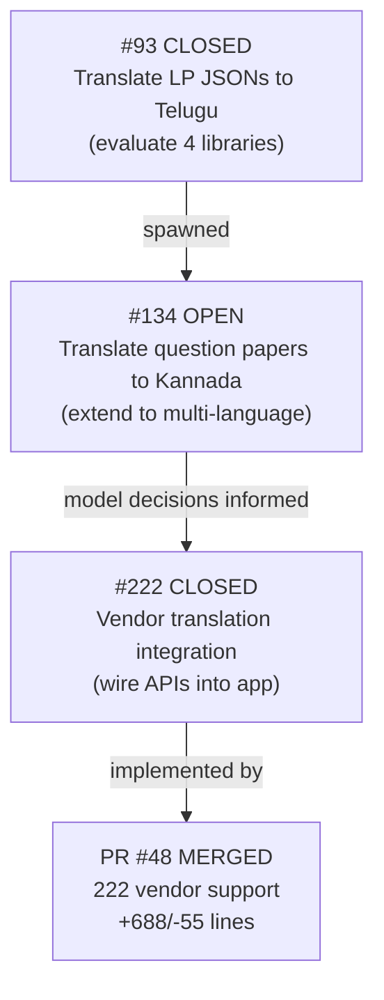

# Translation Issues Summary

> Issues: [#134](https://github.com/A4i-tech/.github/issues/134) (parent) → [#93](https://github.com/A4i-tech/.github/issues/93) (sub-issue, Telugu eval) → [#222](https://github.com/A4i-tech/.github/issues/222) (sub-issue, vendor integration)
> PR merged for #222: [Shiksha-Copilot #48](https://github.com/A4i-tech/Shiksha-Copilot/pull/48)

---

## Issue #134 — Translate question papers into Kannada using existing methodologies

**State:** OPEN
**Author:** Soumabha
**Assignee:** N1kunj1998 (Nikunj)
**Milestone:** 17 (May 1st–2nd wk)

### Summary

Teachers on the Shiksha Copilot website can view lesson plans (in English). Goal is to make translated lesson plans available in regional languages. This issue extends the Telugu translation work from #93 to also cover **Kannada** and potentially other Indic languages.

Builds on top of #93 where 4 translation libraries were already evaluated:
- Meta NLLB
- Google DeepTranslate
- AI4Bharat
- Sarvam Translate

### Action Items (all checked)

- [x] Leverage existing scripts from #93, move to SCM
- [x] Translate key JSON sections: `subtopics`, `learning_outcomes`, `sections`
- [x] Build outputs into shareable zip format for quality evaluation by language experts
- [x] Files translated: Social Science, Mathematics, Science question bank docx files

### Conversation Timeline

```
Pun-it      → Shared combined Colab notebook for all 4 models
Pun-it      → Shared Kannada + Telugu translation zip
Pun-it      → Feedback: Deep Translate missed some translations;
               Word's built-in translator works better than Deep Translate.
               TODO: figure out what Word uses, compare Microsoft vs Deep vs Sarvam
Pun-it      → Update: LLMs should be given vocab context for translations.
               Best models: Telugu=Deep Translate, Kannada=Sarvam AI
Soumabha    → Shared glossary files from Shikshana team (batch2.zip, Sikshana_IV_translated.zip)
Pun-it      → Additional Shikshana file received: Telugu standard samples
Pun-it      → Current task: 2-step pipeline —
               Step 1: Azure Translate for raw translation
               Step 2: GPT-4.1 with Telugu vocabulary for verification/improvement
               Moving to current milestone.
Pun-it      → Waiting for Shikshana review on previous Telugu translations
Pun-it      → No feedback received; new Telugu JSONs received for translation
Pun-it      → Batch 2 sent on 10/03/2026; no feedback on batch 3
Pun-it      → Batch 3 sent on 13/03/2026
Pun-it      → Requested to translate period plans using Sarvam (Azure credits inadequate);
               Sent 3 chapters for evaluation. Ran out of Sarvam credits.
Soumabha    → Feedback from Shikshana curators: Sarvam NOT superior to current model.
               Issues: English terms left untranslated, others just transliterated.
               Decision: continue using Microsoft Word Translator.
Soumabha    → Moving issue to Nikunj for analysis — plan what is done vs what needs doing.
```

### Current Status

Issue still OPEN. Pending: full analysis of done vs pending work, plan for implementation.

---

## Sub-Issue #93 — Translate lesson plan JSONs to Telugu (evaluation)

**State:** CLOSED
**Author:** Soumabha
**Assignee:** Pun-it
**Milestone:** 7 (Dec 1st–2nd wk)

### Summary

For Telangana training, Sikshana needed English LP JSONs translated to Telugu. In-house Telugu translator not complete yet. Task: use available online APIs/models, compare outputs, pick best.

**Keys to translate:** `subtopics`, `learning_outcomes`, `sections.section_title`, `sections.content`
**Keys to keep same:** `section_id`

Models evaluated (max 5):
- Google Translate API
- Sarvam Translate
- AI4Bharat
- Meta NLLB (No Language Left Behind)

### Conversation Timeline

```
Soumabha    → Shared English JSON data (Curated_LP_JSON.zip)
Soumabha    → Libraries shortlisted: AI4Bharat, Sarvam, Google, Meta NLLB.
               Sample output shared with Shikshana team.
               Shared Colab notebooks (separate: AI4Bharat+NLLB and Google+Sarvam)
Soumabha    → Details shared with Shikshana team. Next: selected model applied to all LPs.
Soumabha    → Translate LPs created in #110 (similar to Telugu approach)
Soumabha    → Shared English+Maths JSON files for translation
Soumabha    → All subjects (samples + full) generated and shared with Shikshana Foundation
               for Telugu. New ticket (#134) to be created based on feedback.
```

### Outcome

Telugu translations generated using best-evaluated model and shared with Shikshana Foundation. Issue closed. Spawned #134 for Kannada extension.

---

## Sub-Issue #222 — Vendor provided translation support for question papers

**State:** CLOSED
**Author:** Pun-it
**Assignees:** Soumabha, Pun-it
**Milestone:** 13 (March 1st–2nd wk)

### Summary

Integrate vendor translation APIs into the Shiksha Copilot app (not just offline scripts). Based on model decisions from #134:
- Telugu → Sarvam.ai
- Kannada → Deep Translate

### Conversation Timeline

```
Soumabha    → Design framework to choose models per Indic language.
               More discussion in issue #27 comment. Final libraries post human review.
Soumabha    → New Azure Translator resource set up for staging:
               Resource: scp-staging-translator (swedencentral region)
Pun-it      → Task delayed due to LBA ingestion and general LBA bugs.
               Moving to current sprint.
Pun-it      → Translation currently only for AI-generated questions.
               Adding translation call for LBAs too. Moving to review.
Pun-it      → Translation factory method added.
               Uses default Azure Translator if no translator specified for given language.
```

---

## PR #48 — 222 vendor support (MERGED)

**Repo:** A4i-tech/Shiksha-Copilot
**Author:** Pun-it
**Reviewers:** Soumabha (commented), a4i-architect (commented), mamuqsit (approved)
**Stats:** +688 / −55 lines
**Services:** shiksha-api (FastAPI), shiksha-backend (Express.js), shiksha-frontend (Angular)

### What It Did

#### New: Translation Service Layer (app-service)

| File | Purpose |
|------|---------|
| `app/services/translation/base.py` | Abstract `BaseTranslator` interface |
| `app/services/translation/azure.py` | `AzureTranslator` — chunking, error handling, rate limiting, result parsing |
| `app/services/translation/factory.py` | `TranslatorFactory` — picks correct translator by language, falls back to Azure default |
| `app/services/translation/fallback.py` | Fallback translator when primary fails |
| `app/services/translation/noop.py` | `NoOpTranslator` — returns input unchanged when no credentials configured |
| `app/services/translation_service.py` | `TranslationService` — recursive JSON traversal, batching, depth limiting |

#### Modified Files

| File | Change |
|------|--------|
| `app/config.py` | Added Azure Translator API credentials config flags |
| `app/models/question_paper.py` | Added `target_language` field |
| `app/routers/question_paper.py` | Router reads `target_language`, passes to service |
| `app/services/question_paper_service.py` | Wires async translation into question paper generation; removed placeholder `translate_json` |
| `app/tests/test_translation.py` | Unit tests: happy path, error, depth limit, fallback |
| `shiksha-backend/managers/question.bank.manager.js` | Backend translation call |
| `shiksha-frontend/.../question-bank.service.ts` | Sends `targetLanguage` in API request |
| `shiksha-frontend/.../question-bank-generation.component.ts` | UI wires language selection |

#### Architecture



#### Key Design Decisions

- **Recursive JSON traversal** — `_collect_strings` + `_fill_strings` walk nested JSON to find translatable string values only
- **Batching** — strings collected, sent in batch, filled back — avoids one API call per field
- **Factory pattern** — language-based translator selection; Azure as default fallback
- **NoOp mode** — when no credentials, returns input unchanged; no crash
- **Async** — `translate_batch_async` used throughout question paper flow

#### Code Review Feedback (a4i-architect, score 78/100)

- Factory redundancy: fallback logic always defaults to Azure regardless of `target_lang` — needs clarification
- Recursive depth: consider iterative approach for very deep JSON (noted, not critical)
- Test coverage: needs more fallback/error cases and mock-credential tests
- Type safety: `translate_batch_async` assumes response shape — add validation

---

## Relationship Map


